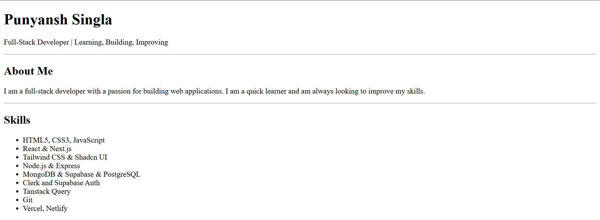
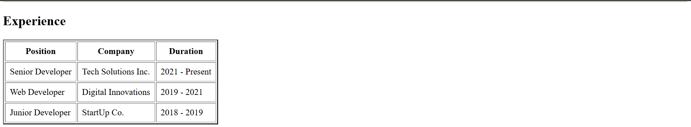
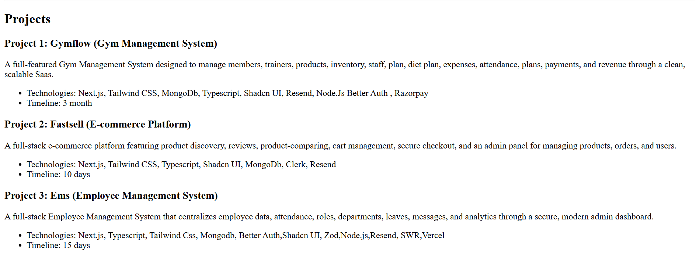
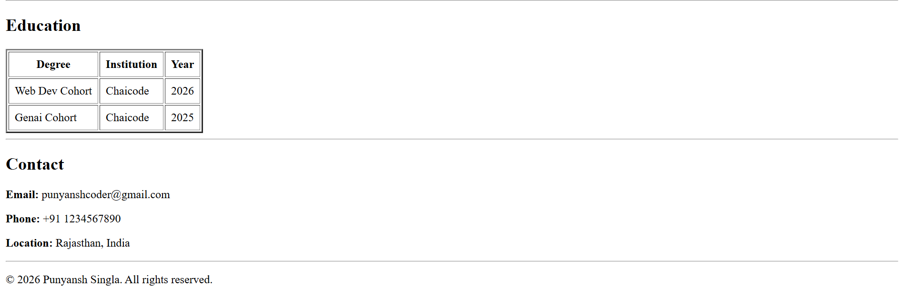

# HTML Resume Page Assignment

## 📸 Preview






*A visual preview showcasing different sections and layouts of the resume.*


## 🛠️ Setup Instructions

To get this project running locally on your machine, follow these simple steps:

1. **Clone the Repository**:
   ```bash
   git clone https://github.com/PunyanshSingla/html-resume-page-assignment
   ```

2. **Open the File**:
   - Simply click `index.html` to open it.

3. **Start a Live Preview**

You can preview your project in the browser using either of the following methods:

**Option 1: Live Server**
- Right-click anywhere inside `index.html`
- Select **Open with Live Server**

**Option 2: VS Code Live Preview**
- Click **Show Preview**
- Or use the **Live Preview** button from the top-right corner of VS Code

## 📖 Usage

- **View Resume**: Open the `index.html` file in any modern web browser.
- **Navigate Sections**: Scroll through the page to review skills, projects, and education.
- **Print or Export**: Use the browser print option (`Ctrl + P` or `Cmd + P`) to save the resume as a PDF.


## 🌐 Technologies Used

- **HTML5**: For structure and semantic .

---
Developed by [Punyansh Singla](mailto:punyanshcoder@gmail.com)
